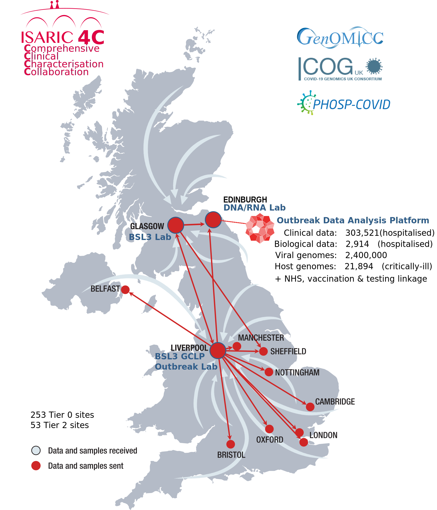
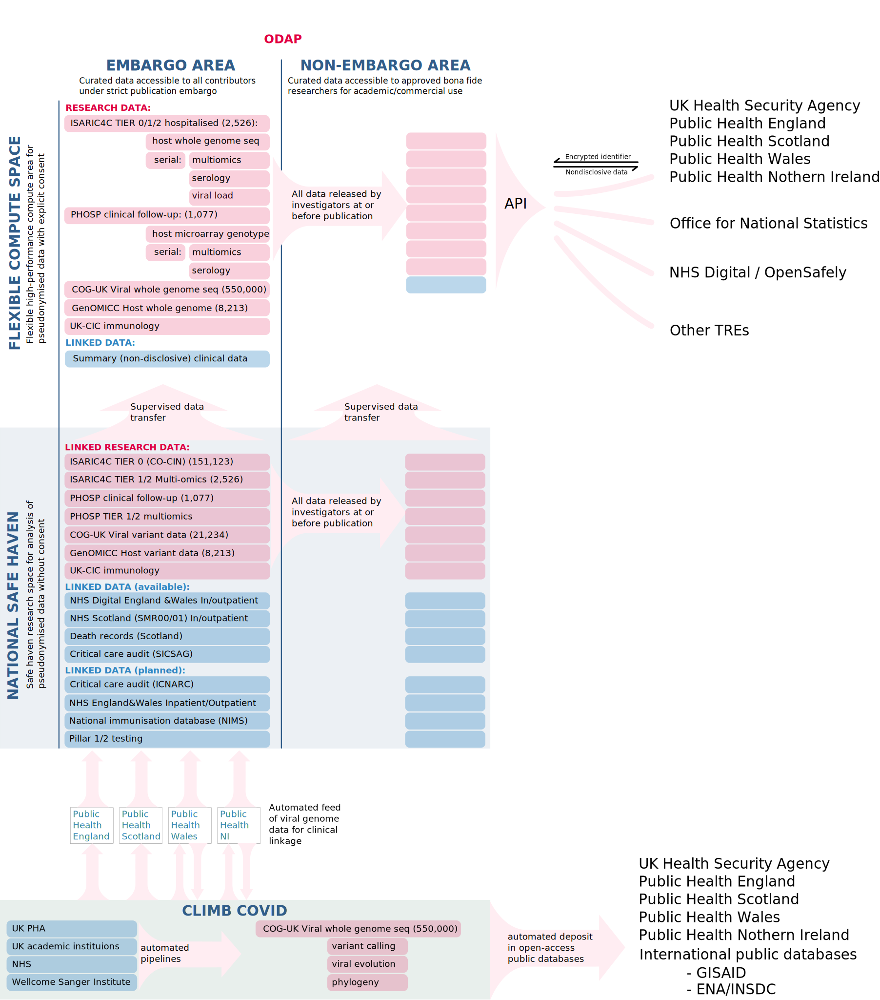

<!--
Outbreak data analysis platform
-->

## Data held

ISARIC4C has developed a clinical and research data integration platform to facilitate integrative analyses of multi-omic, serial disease profiling, stratified by viral variant, clinical phenotype and outcome. This is hosted on nationally-leading, exabyte-scale computational infrastructure including state-of-the-art security systems for protection of identifiable data, and high-performance CPU/GPU computing (the Edinburgh Parallel Compute Centre, EPCC, and ARCHER/ARCHER2).

The ISARIC4C analysis platform exists to *encourgage and facilitate research* by collating, linking and presenting data together with high-performance computational capacity. This platform now serves as a hub for a coordinated UK national research response to COVID-19. Data are included from:

- ISARIC4C tier 0: (unconsented) prospective clinical data from num_crf cases
- ISARIC4C tiers 1 and 2: serial multiomic assays from research samples of blood, respiratory secretions, urine, and stool from num_multiomics cases
- COG-UK: (unconsented) summary variant data from COG-UK viral sequencing study is already included for matched patients
- [GenOMICC study](https://genomicc.org/uk) complete data: microarray and whole genome sequence data from num_genomicc cases
- PHOSP complete data: follow-up clinical and biological data generated by the Post-Hospitalisation for COVID-19 follow-up study (num_phosp cases)
- UK-CIC: deep immunological phenotyping data from across the UK Coronavirus Immunology Consortium, using ISARIC4C samples and local collections.

## Linkage to clinical data

Research data within the analysis platform is already linked to:
- NHS Scotland primary, secondary care and death records
- NHS Digital health records data

In future, plans are in place to transfer data to link with:
- ICNARC and SICSAG critical care audit databases
- NIMS National Immunisation Dataset
- Pillar 1 testing
- Pillar 2 testing
- ONS

{#fig:map width=60%}

## Research outputs

The [ISARIC Coronavirus Clinical Characterisation Consortium (4C)](https://isaric4c.net) is the largest observational study of hospitalised patients with COVID-19 anyhwere in the world. Through acquisition, integration and analysis of clinical, biological, genetic and virological data on patients with Covid-19 in UK hospitals, ISARIC4C has provided essential weekly updates to SAGE that guide the public health response, and enabled understanding of the clinical features,[@dochertyFeatures201332020] prognostication,[https://doi.org/10.1136/bmj.m3339] disease biology[@thwaitesElevatedAntiviralMyeloid2020] and host genetics.[doi:10.1038/s41586-020-03065-y]

## Analysis platform structure

There are two routes of access to the analysis platform:
1. NHS Trusted Research Environment (Safe Haven) for access to personal clinical data and data collected without explicit consent.
2. Rapid-access flexible compute for access to non-disclosive research data collected with explicit consent.

Within both of these environments there is an additional division in the data:
1. Publishable "open access" data which any user can use and report as they wish, according to data protection and privacy rules;
2. Embargoed active research data, shared by academic investigators and available for linked analysis but not for publication without agreement from all contributors.

This design is intended to build trust in order to encourage immediate contributions of research data from academic collaborators.

{#fig:structure width=60%}

## Future plans

Rapid addition of viral sequence data from the COG-UK platform will enable real-time detection of the clinical impact of new viral strains, in-depth biological study of reinfection, and host:pathogen interactions at a genetic and mechanistic level.

<!--
# Background

## Earning trust from data contributors

The default position is that data are contributed under embargo, prohibiting publication or general release until authorised by the data contributor. All contributors will agree to abide by this rule in good faith. Embargoed data will be available to other contributors during the embargo period, and will be released into the open analysis platform at or before the time of the first pre-print report.

A critical determinant of success is building sufficient trust among contributors to ensure that data are contributed in an accessible format as early as possible. Data sharing within the ISARIC4C consortium continues to have the support and goodwill of contributors, because:
- there is a palpable urgency created by the COVID-19 crisis;
- the platform has earned the trust of contributors and will maintain it by enforcing embargo rules;
- there is a clear expectation from patients, the public, funders and government;
- there is primary benefit to data contributors to gain access to other unpublished data and analysis platforms.

## Principles

ISARIC4C is built on top of existing pandemic preparedness infrastructure, designed, established, maintained and tested during the interpandemic period (@fig:map),[PMID: 24355025] and harmonised across the world.[PMID: 32502433] It is an open-access national resource: we have already shared data on num_crf participants and 4273 samples with 26 external groups.

The success of ISARIC4C is largely due to the following foundational principles:

- no group, funder, collaborator or other party will have exclusive access to data or samples
- consortium resources (samples, data and funds) will be prioritised according to likelihood of rapid impact on the COVID-19 pandemic
- all data generated using ISARIC4C resources is shared in a machine-readable format within the Integrated Analysis Platform

## Open analysis platform for deidentified data

The analysis platform is being used to provide itegrated analyses of genetic associations with multiple phenotypes,[@canela-xandriAtlasGeneticAssociations2018] functional genomics,[PMID: 24670764] and multi-omics critical illness trajectories,[@neytonMolecularPatternsAcute2020] within the largest clinical study of COVID-19 anywhere in the world.[https://doi.org/10.1136/bmj.m1985]

{#fig:dataplatform width=80%}

The platform hosts overlapping datasets from across the UK. Individual patient consent enables sharing of linked whole-genome sequence data, whole-blood transcriptomics, proteomics, cytokine measurements, viral load and sequence, and clinical data. This will enable a range of discovery science with direct therapeutic applications, including subphenotype classification and extended causal inference using Mendelian randomisation and related approaches.

Providing clean, linked, deidentified data in a format that is easily accessible to researchers from a range of backgrounds requires staff with a high level of skill in clinical epidemiology, data science, and software engineering. Data will be systematically cleansed and linked, missing data completed in an iterative process interacting with analysis teams, and presented in curated flat files and through an integrated relational database. This will be presented to users through four interfaces:

1. a user-friendly browsable interface enabling data selection and subgrouping through dropdown menus to subset patient populations by clinical and biological data and run *de novo* GWAS analyses using a GPU platform (GOLEM, Tenesa group), multivariable regression, propensity-matching, unsupervised clustering and other analyses.

2. flexible analysis through bespoke, secure virtual machines operated through a command line interface providing access to R, Python, and other software as required by the user.

3. a well-documented application programming interface (API) enabling external computational queries. This allows all data in the ISARIC4C platform to contribute to federated data analysis frameworks at national and international level. Collaborating groups such as OPENSafely and Genomics England will be able to run queries seamlessly from external platforms.

4. a limited, anonymised, downloadable dataset comprising key variables from all participants.

Deidentified data will be available openly to *bona fide* researchers for unrestricted analyses

## Data safe haven

A linked, secure NHS data safe haven will provide access to identifiable data, and data collected without individual patient consent, for qualified, approved researchers performing research to improve patient care. This incorporates full ISARIC COVID case report forms for 46,000 patients, together with health records linkage (CAG section 251 and PBPP approvals in place).

This will enable detailed, rich clinical analyses with corrections for confounding and bias caused by social factors, comorbid illness and medications, and opens a range of detailed information to characterise acute disease using clinical measurements acquired from electronic health records.

| Dataset                           | Governance responsibility | Delegates  |
| --------------------------------- | ------------------------ | -------------------------------------------- |
| [ISARIC4C TIERS 0(CO-CIN)/1/2](https://isaric4c.net/analysis-platform)   | Kenneth Baillie (for IDAMAC) | Calum Semple; Gary Leeming; Andy Law;  Wilna Oosthuyzen |
| COG-UK | Sharon Peacock   | Ewan Harrison |
| PHOSP  | Chris Brightling | Aarti Parmar  |
| [GenOMICC](https://genomicc.org/data)   | Kenneth Baillie  | Andy Law; Alison Meynert; Wilna Oosthuyzen  |
| UK CIC | Paul Moss  |   |
| [SICSAG](https://www.isdscotland.org/Health-Topics/Scottish-Healthcare-Audits/Scottish-Intensive-Care-Society-Audit-Group/) | Naz Lone (for SICSAG steering committee) |   |
| [Outpatients (SMR00)](https://www.ndc.scot.nhs.uk/National-Datasets/data.asp?ID=1&SubID=4) |   |   |
| [GeneralAcute and Inpatient Day Case dataset (SMR01)](https://www.ndc.scot.nhs.uk/National-Datasets/data.asp?ID=1&SubID=5)  |   |   |
| [Prescribing Information System (PIS)](https://www.isdscotland.org/health-topics/prescribing-and-medicines/_docs/Open_Data_Glossary_of_Terms.pdf?1) |   |   |
| [NRS Deaths](https://www.ndc.scot.nhs.uk/National-Datasets/data.asp?ID=3&SubID=13)   |   |   |
| Primary Care | GP committee  |   |
| NHS England  |   |   |
| NIMS National Immunisation Dataset   |   |   |
| Pillar 1 testing   |   |   |
| Pillar 2 testing   |   |   |

-->

<!--
## Use cases

Genomics person docker containers

# List of data acquisitions:

https://hackmd.io/@baillielab/datalinkage

-->

# References

