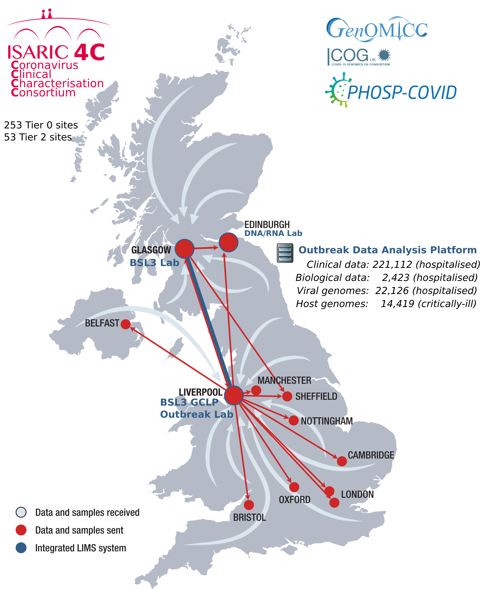

# ISARIC4C Comprehensive Clinical Characterisation Collaboration

ISARIC4C is an open, inclusive UK-wide collaboration of doctors and scientists committed to answering urgent questions about emerging infections and public health threats quickly, openly, and for the benefit of all. It is the research link between scientists, public health agencies, and NHS teams across the UK. We share data and samples to get answers as fast as possible. 

Since 2012 we have been preparing for outbreaks worldwide be helping scientists to be ready in advance through the [International Severe Acute Respiratory Infection Consortium Clinical Characterisation Protocol](https://isaric4c.net/protocols/). 

Any investigators with the ability to contribute can [access our data and samples](sample_access). The ISARIC4C study provides a foundation for other studies, such as clinical trials of new treatments, to help better understand the best way to use interventions. 

## Current activity

ISARIC4C is currently actively recruiting cases in the UK with:

- confirmed or suspected exposure to **Andes hantavirus**

## Previous work

ISARIC4C was pivotal to the research response to Covid-19, unexplained acute hepatitis in children, and monkeypox.

*“…it has captured a large proportion of UK hospital cases and it has proven extremely useful to both SAGE and SPI-M. It has, for example, been vital in identifying risk factors associated with poor outcomes as well as well as early signs of the prevalence of hospital-acquired infection.”*

Sir Patrick Vallance, UK Government Chief Scientific Adviser and Head of the Government Science and Engineering Profession, written evidence to Parliament
(24 July 2020)

## Analysis Platform

The ISARIC4C study has created an open-access [integrated analysis platform](analysis-platform) for linked clincal data from across the NHS for a range of studies, including ISARIC4C, GenOMICC, PHOSP, COG-UK and UK-CIC.

## Funding

ISARIC4C is funded by UK Research and Inovation (UKRI), the Medical Research Council, The National Institute For Health Research (NIHR), the Baillie Gifford Pandemic Science Hub in Edinburgh. 

