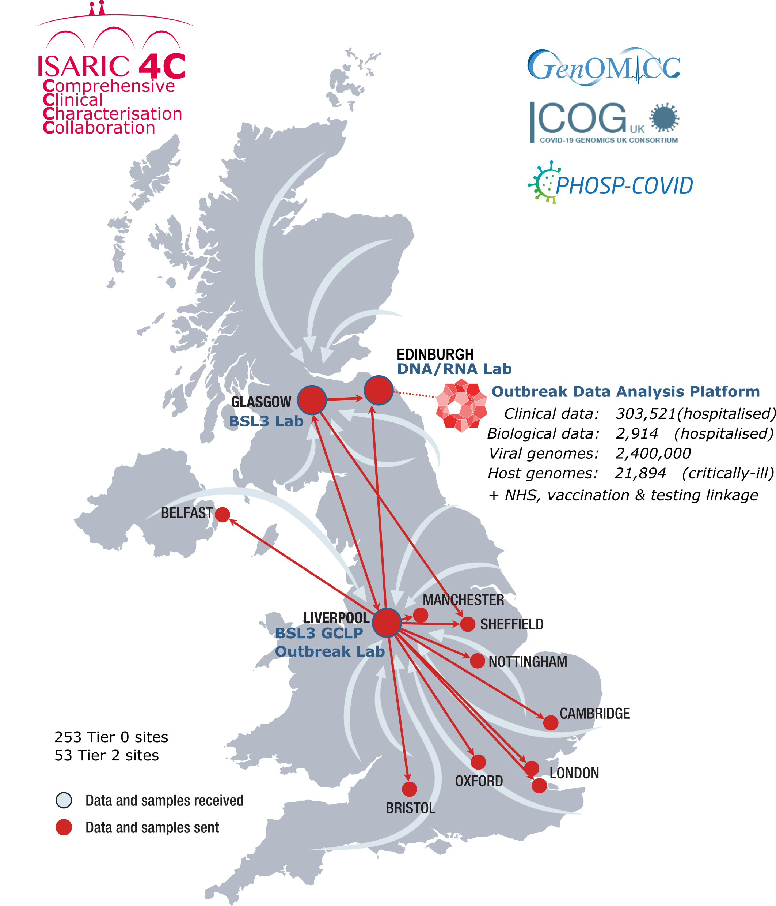

# ISARIC4C Comprehensive Clinical Characterisation Collaboration

ISARIC4C is an open, inclusive UK-wide collaboration of doctors and scientists committed to answering urgent questions about emerging infections and public health threats quickly, openly, and for the benefit of all.

ISARIC4C is the link between scientists, public health agencies, and NHS teams across the UK. 

Since 2012 we have been preparing for outbreaks worldwide. 
[International Severe Acute Respiratory Infection Consortium Clinical Characterisation Protocol](https://isaric.net/ccp). 

## ISARIC4C was at the core of the UK's response to COVID-19

*“…it has captured a large proportion of UK hospital cases and it has proven extremely useful to both SAGE and SPI-M. It has, for example, been vital in identifying risk factors associated with poor outcomes as well as well as early signs of the prevalence of hospital-acquired infection.”*

Sir Patrick Vallance, UK Government Chief Scientific Adviser and Head of the Government Science and Engineering Profession, written evidence to Parliament
(24 July 2020)

## Recruitment

ISARIC4C is currently actively recruiting cases in the UK with:

	- unexplained acute hepatitis
	- monkeypox

## Analysis Platform

The ISARIC4C study has created an open-access [integrated analysis platform](analysis-platform) for linked clincal data from across the NHS for a range of studies, including ISARIC4C, GenOMICC, PHOSP, COG-UK and UK-CIC.

## Funding

ISARIC4C is funded by UK Research and Inovation (UKRI) and The National Institute For Health Research (NIHR). We share data and samples to get answers as fast as possible. Any investigators with the ability to contribute can [access our data and samples](sample_access). The ISARIC4C study provides a foundation for other studies, such as clinical trials of new treatments, to help better understand the best way to use interventions.
