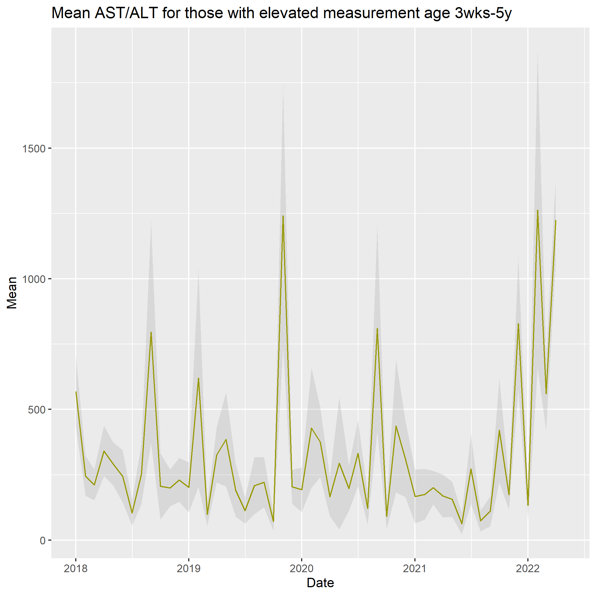

<!--
Contributors
Iain Jones

Clark Russel
Maaike Swets
Geert Groenveld
Calum Semple

Louisa Pollock
Kenneth Baillie

build:
pandoc index.md -o pdf
-->

# Incidence series study of elevated liver transaminases

A series of cases of severe hepatitis in young children was recognised in central Scotland in March 2022. By the end of May, WHO had identified [650 cases worldwide](https://www.who.int/emergencies/disease-outbreak-news/item/DON-389), in some cases leading to liver transplant or death. The cause is unknown. It is possible that this outbreak has been  more widespread. In particular, milder, self-limiting disease may not have been recognised, but might be evident from larger numbers of children having abnormal liver function tests.

In this study (SALT - Summary Analysis of Lab Tests) we are trying to detect changes in the proportion of children with abnormal liver function tests (elevated AST/ALT). We are trying to determine if an increase in the proportion of elevated transaminases has occurred, where, and over what period. 

The SALT study uses summary tables of data, of the type which are routinely published in academic journals and management reports. By using only summary data tables, we avoid the risk of disclosing any confidential clinical information about a person.

<caption>Graph of averaged elevated transaminase levels (ALT & AST, >200iu/l) in children aged 3 weeks to 5 years, in all centres included so far (UK & Netherlands).</caption>

# Contribute data from your centre

We urgently need clinical biochemists to contribute data from their centre to help track this outbreak.

## Script

We have written a script to read through a table of blood results and create a summary table in the right format for this analysis. The script works even if there are tens of millions of lines. It runs on your computer, doesn't communicate with the internet in any way, and creates simple summary tables (see below) which you can then share with us.

The script is written in a computing language called python. Because python doesn't come pre-installed on windows computers, we've bundled our script with a python version that can be used without any installation or special permissiona.

OPERATING SYSTEM | DOWNLOAD LINK
----- | ------
Windows (standalone) | [download_windows](AST_ALT_counter_win.zip)
Windows (script only) | [download_script](AST_ALT_counter.zip)
Mac/Linux | [download_script](AST_ALT_counter.zip)

To read more about the script, please see the [README.md file](code/README)

## Data collection

In order to comply with information governance requirements, eliminate the risk of confidential disclosure, and make use of routine lab data, the following summary data will be collected in [csv](template.csv) format from hospitals:

We will count the number of *hospital inpatients* tested for blood levels of AST or ALT for whom the result was >200iu/l on at least one occasion, and the total number of patients for whom AST or ALT was measured. We will also calculate the mean and variance of these measurements. So count, mean and variance will be collected for:

- each month from Jan 2012 and March 2022 to the present
- each age bracket in this list: <3wks, 3wks-5y, 6-10y, 11-16y, 17-30y, 31-50y, 51-70y, >70

Where the same patient has more than one result, the first result over the threshold is counted, or the first result from that patient, if no results over the threshold are present.

## Sending data

If you are sending data from multiple hospitals, please use a separate file for each one. Please send your *summary data files only*, containing no patient identifiers, to this email address: [ccp@ed.ac.uk](mailto:ccp@ed.ac.uk)

Please also include the following details so that we can credit you appopriately with your contribution:

- location of hospital
- institutional email addresses of contributing scientists

## Ethical approval

This work is surveillance for public health using summary data only and so does not require ethical approval. 

## Summary table format

The table below shows the format of the summary data to be collected from each contributing laboratory. This can be [downloaded in csv format here](table/template.csv).



